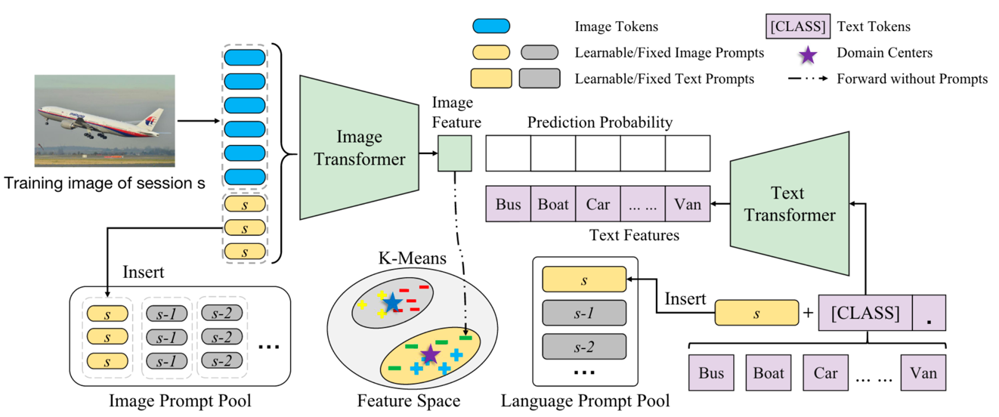
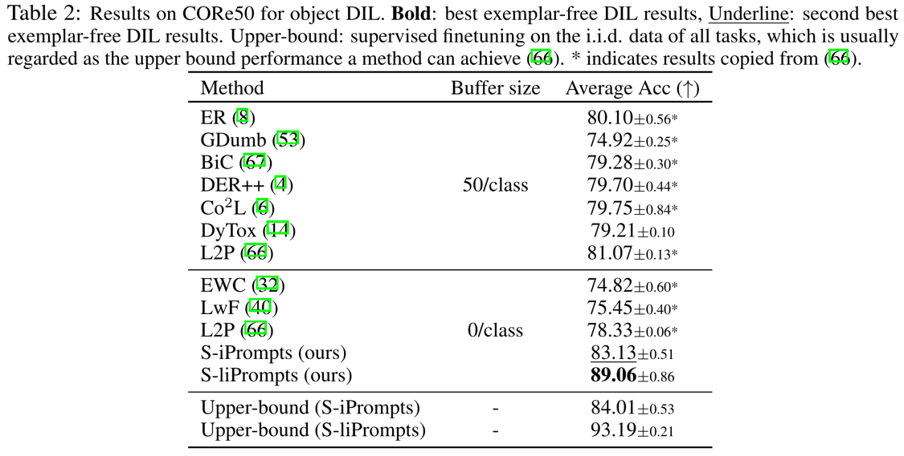
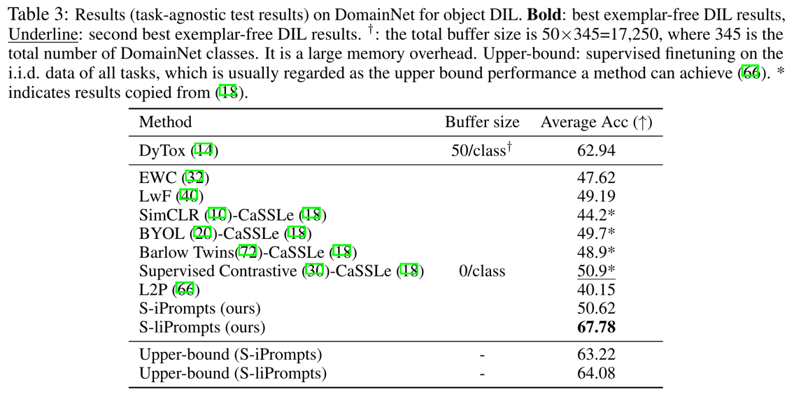

# S-Prompts Learning with Pre-trained Transformers: An Occam’s Razor for Domain Incremental Learning

This is the official implementation of our NeurIPS 2022 paper "S-Prompts Learning with Pre-trained Transformers: An Occam’s Razor for Domain Incremental Learning".
In this paper, we propose one simple paradigm (named as S-Prompting) and two concrete approaches to highly reduce the forgetting degree in one of the most typical continual learning scenarios, i.e., domain increment learning (DIL).

**S-Prompts Learning with Pre-trained Transformers: An Occam’s Razor for Domain Incremental Learning** <br>
Yabin Wang, Zhiwu Huang, Xiaopeng Hong <br>
[[Paper]](https://arxiv.org/pdf/2207.12819.pdf)

## Introduction

S-Prompts introduce a rule-breaking idea to play a win-win game for domain incremental learning.
Specifically, S-Prompts uses a new prompting paradigm that learns the prompts independently domain by domain, and incrementally inserts the learned prompts in a pool.
The learning process only requests the most naive cross-entropy loss for supervision. 
The inference is also simple and efficient. 
It simply uses K-NN to search for the nearest domain center generated by K-Means on the training data to the features of the given test sample, followed by prepending the learned domain-associated prompts with the image tokens to the transformer for the final classification. 
As S domain-related prompts will be finally learned independently, where S is the total number of domains, we name the proposed paradigm as S-Prompts or S-Prompting for simplicity throughout the paper. 
We hope the proposed S-Prompting becomes an Occam’s Razor (i.e., a simple and elegant principle) for DIL.





## Enviroment setup
Create the virtual environment for S-Prompts.
```python
conda env create -f environment.yaml
```
After this, you will get a new environment **sp** that can conduct S-Prompts experiments.  
Run `conda activate sp` to activate.

Note that only NVIDIA GPUs are supported for now, and we use NVIDIA RTX 3090. 

## Dataset preparation
Please refer to the following links to download data.  
[DomainNet](http://ai.bu.edu/M3SDA/)  
[CORe50](https://vlomonaco.github.io/core50/index.html#dataset)  
[CDDB](https://arxiv.org/abs/2205.05467)  

Unzip the downloaded files, and you will get the following folders.
```
domainnet
├── clipart
│   ├── aircraft_carrier
│   ├── airplane
│   ... ...
├── clipart_test.txt
├── clipart_train.txt
├── infograph
│   ├── aircraft_carrier
│   ├── airplane
│   ... ...
├── infograph_test.txt
├── infograph_train.txt
├── painting
│   ├── aircraft_carrier
│   ├── airplane
│   ... ...
... ...
```

```
core50
└── core50_128x128
    ├── labels.pkl
    ├── LUP.pkl
    ├── paths.pkl
    ├── s1
    ├── s2
    ├── s3
    ...
```
```
CDDB
├── biggan
│   ├── train
│   └── val
├── gaugan
│   ├── train
│   └── val
├── san
│   ├── train
│   └── val
├── whichfaceisreal
│   ├── train
│   └── val
├── wild
│   ├── train
│   └── val
... ...
```

## Training:

Please change the `data_path` in the config files to the locations of the datasets。  

Currently, there are two options for `net_type` in the config files: `slip` and `sip`.  
`slip` means S-liPrompts and `sip` means S-iPrompts.  

Feel free to change the parameters in the config files, following scripts will reproduce the main results in our paper.

### DomainNet:
```
python main.py --config configs/domainnet_slip.json
```

### CORe50:
```
python main.py --config configs/core50_slip.json
```

### CDDB:
```
python main.py --config configs/cddb_slip.json
python main.py --config configs/cddb_sip.json
```

## Evaluation:

Please refer to 
[[Evaluation Code]](https://github.com/iamwangyabin/SPrompts_eval).


## Results





## License

Please check the MIT  [license](./LICENSE) that is listed in this repository.

## Acknowledgments

We thank the following repos providing helpful components/functions in our work.

- [PyCIL](https://github.com/G-U-N/PyCIL)
- [L2P](https://github.com/google-research/l2p)
- [CLIP](https://github.com/openai/CLIP)
- [CoOp](https://github.com/KaiyangZhou/CoOp)

## Citation

If you use any content of this repo for your work, please cite the following bib entry:
```
@article{wang2022s,
  title={S-Prompts Learning with Pre-trained Transformers: An Occam's Razor for Domain Incremental Learning},
  author={Wang, Yabin and Huang, Zhiwu and Hong, Xiaopeng},
  journal={arXiv preprint arXiv:2207.12819},
  year={2022}
}
```
